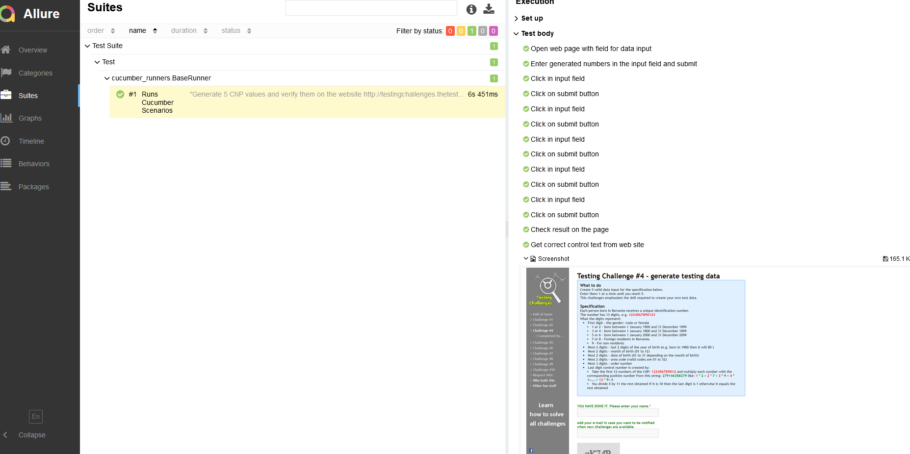

# Project Description
* This project is a CNP (Cod Numeric Personal) Generator, a unique identification number assigned to individuals born in Romania. The CNP has 13 digits and contains encoded information about the person's gender, birthdate, birth year, and other details.
#  Technologies and Stack Used
The CNP Generator project is implemented using the following technologies and stack:

* Java 11+: The primary programming language for implementing the CNP generation logic.

* Maven 3.9.3 : Used as the build and dependency management tool to organize the project's structure and manage external libraries.

* Cucumber : Employed for Behavior-Driven Development (BDD) to write test scenarios in a human-readable format.

* TestNG 7.4.0 : Used for running tests and generating test reports.

* Allure Report: Utilized for generating detailed test reports with test execution statistics and logs.

* Git: Version control system for collaborative development and code management.

# Project Structure
The project follows a standard Java project structure:

* src/main/java: Contains the main Java code for the CNP generation logic and utility classes.

* src/test/java: Contains the test classes with Cucumber scenarios and TestNG test methods to validate the CNP generation.

* pom.xml: The Maven configuration file that defines project dependencies, plugins, and other build settings.

# How to Use
To generate CNPs and run the tests:

* Clone the project from the GitHub repository.

* Ensure you have Java, Maven and Allure installed on your system.

* Open the project in your preferred IDE.

* The Cucumber scenarios will generate 5 CNP values and verify them on the website http://testingchallenges.thetestingmap.org/challenge4.php. Each CNP will be added to the "Please enter a valid CNP number.*" field to check its validity.

* Run the tests using TestNG and the testng.xml configuration to verify the correctness of the CNP generation logic.

* After running the tests, view the Allure report for detailed test execution results. Use next commands in cmd to see report:
* cmd: allure serve allure-results

# CNP Generator

The CNP Generator is a Java class designed to create unique and valid Citizen Personal Identification Numbers (CNP). The CNP is a 13-digit number that contains various information such as gender, date of birth, area code, and a control number for validation.

# How it works:

* The generator uses a Random instance to generate random values for the CNP components.
* The generateCNP method is the main entry point that generates a valid CNP.
* It starts by generating the gender digit (1-9), where 1 or 2 represent people born between 1900-1999, 3 or 4 represent people born between 1800-1899, 5 or 6 represent people born between 2000 and the current year, and 7, 8, or 9 represent people born between 1800 and the current year.
* The method then calculates the birth year based on the generated gender, ensuring that it falls within the appropriate range.
* Next, it generates the birth month (1-12) and ensures that the date of birth (1-31) is valid based on the generated month and year.
* The area code is generated (01-52), and the order number is randomly generated (000-999).
* Lastly, the control number is calculated based on the first 12 digits of the CNP, using a predefined position number sequence and a modulo operation.
* The generator ensures that each generated CNP is unique and adheres to the specified rules for gender and birth year. 

# Example Allure report 
